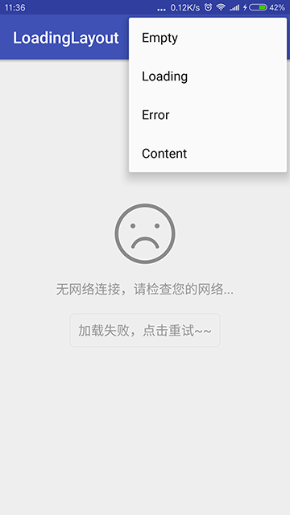
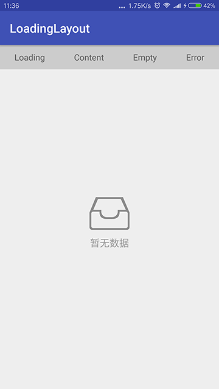

# LoadingLayout
 
简单实用的页面多状态布局(content,loading,empty,error)  
 

 

## Gradle

``` groovy
repositories { 
    mavenCentral()
} 
dependencies {
    implementation 'io.github.xueqiya:LoadingLayout:1.0.1'
}
```
    
## Usage 

**在主题中设置默认样式**

``` xml 
<style name="AppTheme" parent="Theme.AppCompat.Light.DarkActionBar">
    ...
    <item name="styleLoadingLayout">@style/LoadingLayoutStyle</item>
</style>

<style name="LoadingLayoutStyle" parent="LoadingLayout.Style">
    <item name="llEmptyImage">@drawable/empty</item>
    <item name="llErrorImage">@drawable/error</item>
    ...
</style>
```

**用法一：在布局中使用**

``` xml  
<com.xueqiya.loading.LoadingLayout
    android:id="@+id/loading"
    android:layout_width="match_parent"
    android:layout_height="match_parent">

    <TextView
        android:layout_width="match_parent"
        android:layout_height="match_parent"
        android:gravity="center"
        android:text="This is Content"/>
        
</com.xueqiya.loading.LoadingLayout>
 
``` 

**用法二：包裹并替换内容元素**

``` java   
@Override
protected void onCreate(Bundle savedInstanceState) {
    super.onCreate(savedInstanceState);
    setContentView(R.layout.activity_main);
    
    // ...
    
    vLoading = LoadingLayout.wrap(this); 
    vLoading.showContent(); 
    
    // ...
}
``` 
**API**

``` java
// 显示 content/loading/empty/error 布局
showContent()
showLoading()
showEmpty()
showError()

// 设置 loading/empty/error 布局
setLoading(int resId)
setEmpty(int resId)
setError(int resId)

// 设置空布局的图片与文本
setEmptyImage(int resId)
setEmptyText(String value)

// 设置错误布局的图片与文本，
setErrorImage(int resId)
setErrorText(String value) 

// 设置重试按钮文本
setRetryText(String value)

// 设置重试按钮的监听回调
setRetryListener(OnClickListener listener)

```

**属性**

``` xml  
<declare-styleable name="LoadingLayout">
    <!-- 空布局资源id -->
    <attr name="llEmptyResId" format="reference"/>
    <!-- 加载中布局资源id -->
    <attr name="llLoadingResId" format="reference"/>
    <!-- 错误布局资源id -->
    <attr name="llErrorResId" format="reference"/>

    <!-- 空布局图片 -->
    <attr name="llEmptyImage" format="reference"/>
    <!-- 空布局文本 -->
    <attr name="llEmptyText" format="string"/>

    <!-- 错误布局图片 -->
    <attr name="llErrorImage" format="reference"/>
    <!-- 错误布局文本 -->
    <attr name="llErrorText" format="string"/>
    <!-- 错误布局重试按钮文本 -->
    <attr name="llRetryText" format="string"/>

    <!-- 文本颜色 -->
    <attr name="llTextColor" format="color"/>
    <!-- 文本尺寸 -->
    <attr name="llTextSize" format="dimension"/>

    <!-- 按钮文本颜色 -->
    <attr name="llButtonTextColor" format="color"/>
    <!-- 按钮文本尺寸 -->
    <attr name="llButtonTextSize" format="dimension"/>
    <!-- 按钮背景 -->
    <attr name="llButtonBackground" format="reference"/>
</declare-styleable>
``` 


 

## License

```
Copyright 2021 xueqiya

Licensed under the Apache License, Version 2.0 (the "License");
you may not use this file except in compliance with the License.
You may obtain a copy of the License at

   http://www.apache.org/licenses/LICENSE-2.0

Unless required by applicable law or agreed to in writing, software
distributed under the License is distributed on an "AS IS" BASIS,
WITHOUT WARRANTIES OR CONDITIONS OF ANY KIND, either express or implied.
See the License for the specific language governing permissions and
limitations under the License.
```